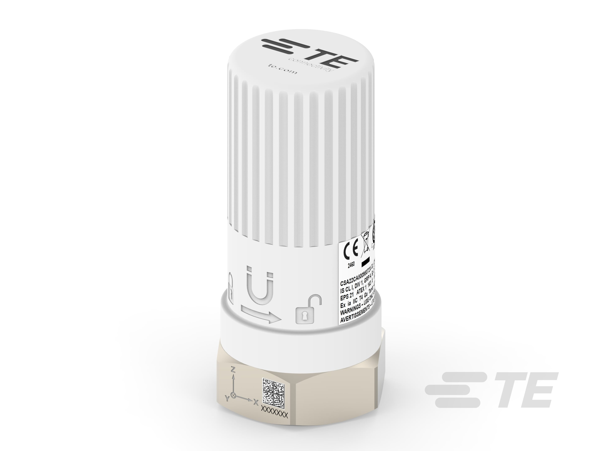

# Vibration Monitoring — Field Guide

Sensor: **TE Connectivity WVS** wireless tri-axial accelerometer

*Note the X/Y/Z axis marker on the hex base (align **X** with the shaft), the
magnetic twist-mount indicator, the threaded/stud base, and the Ex ia IIC (ATEX/IS)
rating for hazardous machinery spaces.*

---

## Mounting method — decision tree (best → temporary)

| Method | Use case | Notes |
|---|---|---|
| **Stud mount** | Permanent monitoring points | Best frequency response; solid metal-to-metal contact; conveys the full spectrum |
| **Epoxy mount** | Permanent; no stud possible | 2-part hard-curing epoxy (e.g. Loctite AA 330). Detach magnetic base, epoxy it to machine, re-thread sensor. |
| **Two-pole magnet** | Curved housings (e.g. motor end caps) | Two feet grip curved surfaces. Gently roll sensor into contact — do not thump it down. Do **not** use a flat magnet directly on a curved surface. |
| **Flat magnet on glued/soldered metal target** | Painted or curved surfaces where direct contact is impractical | Epoxy or solder a small flat metal target to the machine; mount flat magnet on the target. |
| **Flat magnet on clean flat surface** | Temporary spot-checks only | Magnets shift on dirty or irregular surfaces. For trend data, prefer a permanent mount. |

---

## Surface preparation

- Remove **all paint and rust** from the mounting area — multiple paint layers and rust severely dampen or block the signal.
- Vibration must travel through solid, continuous metal; any gap or joint in the path corrupts the reading.
- Target a **robust, flat, fully cleaned bearing-housing area**.

---

## Where to mount — placement

- Mount as close as feasible to the **monitored bearing**.
- Target the **load zone**: the section of the bearing housing that carries the rotating shaft — defects show up earliest there.

**On marine machinery take points at:**

1. Motor non-drive end (NDE) bearing housing
2. Motor drive end (DE) bearing housing
3. Driven-end bearing (pump / compressor / fan / purifier)

---

## What to avoid

Do **not** mount on:

- Thin cooling fins
- Plastic covers or fan shrouds
- Component enclosures

These surfaces resonate at their own frequencies or attenuate the true signal, producing inaccurate data.

---

## Sensor orientation (axis alignment)

The WVS is tri-axial (X / Y / Z axes).

1. Align the **X axis** (marked on the sensor body) with the motor **drive shaft**.
2. Keep the **same orientation on every visit** and across comparable machines.
3. Take readings at the **same physical point** each visit.

Inconsistent orientation makes trend analysis unreliable — today's X reading becomes last month's Y.

---

## Taking the reading

1. Mount the sensor at the designated point using the appropriate method above.
2. Allow a brief settle time after mounting (especially magnetic mounts).
3. Confirm the sensor is paired and transmitting in the WVS app / Mechbase.
4. Note the velocity value (mm/s RMS) displayed.

---

## Recording the reading in Mechbase

Open the assigned **Route** on your device → tap the **Measurement Item** for this point → the item shows the limit band (minor / major alert thresholds). Enter the velocity value (mm/s) and confirm. The system records the timestamp, value, and your user ID automatically.
